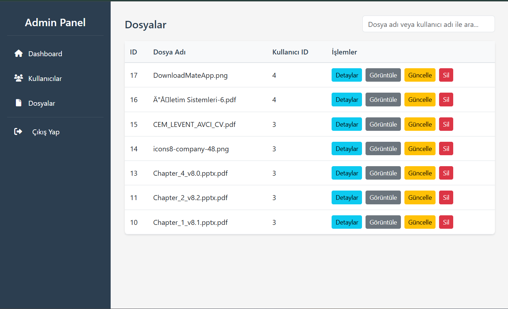
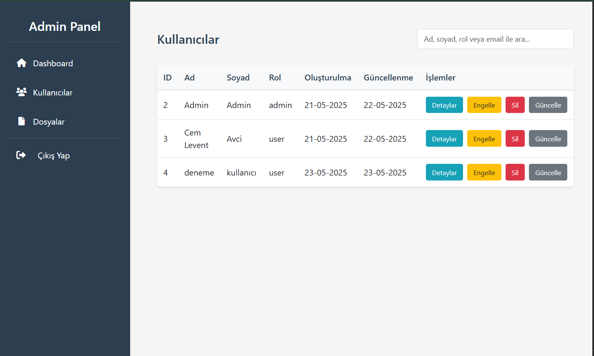
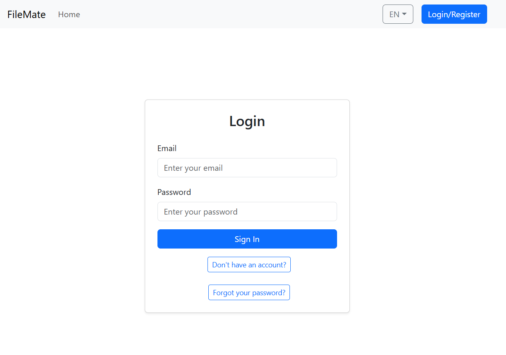
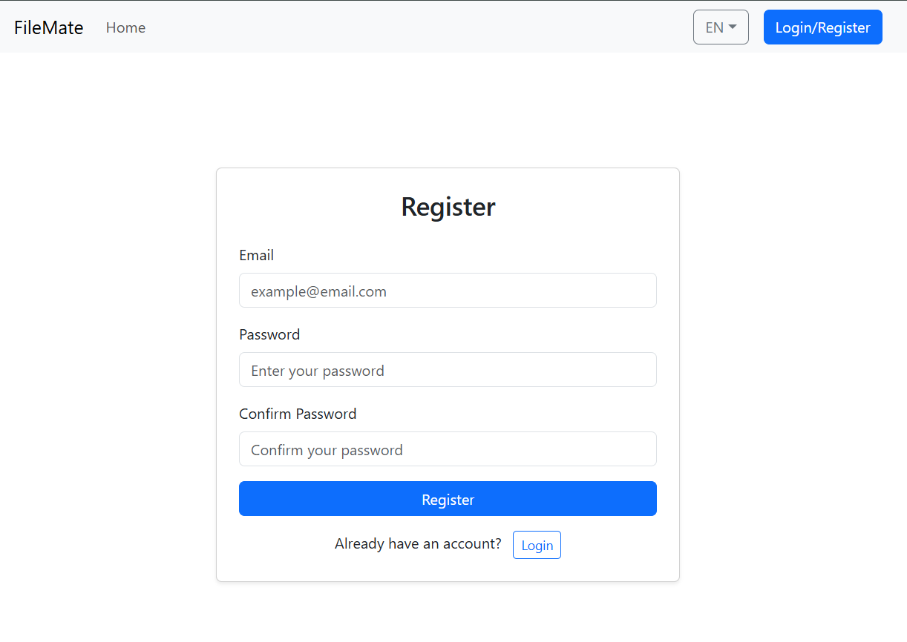
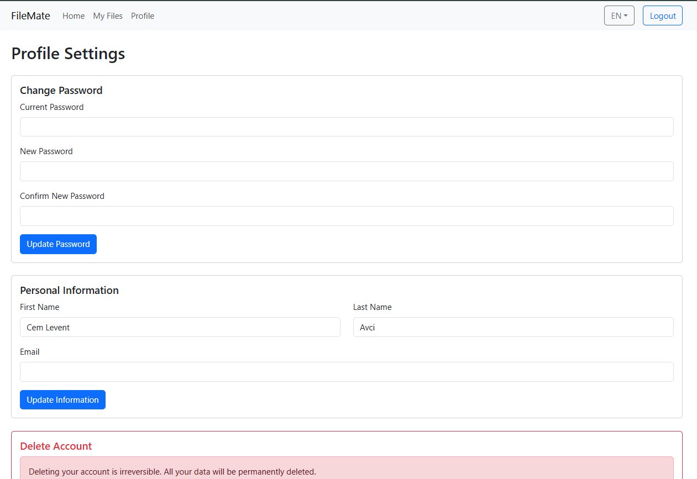
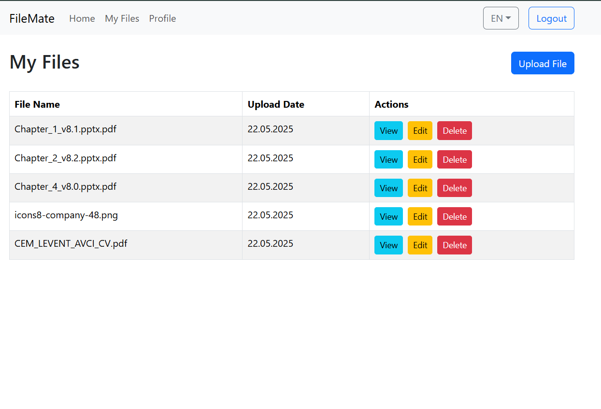
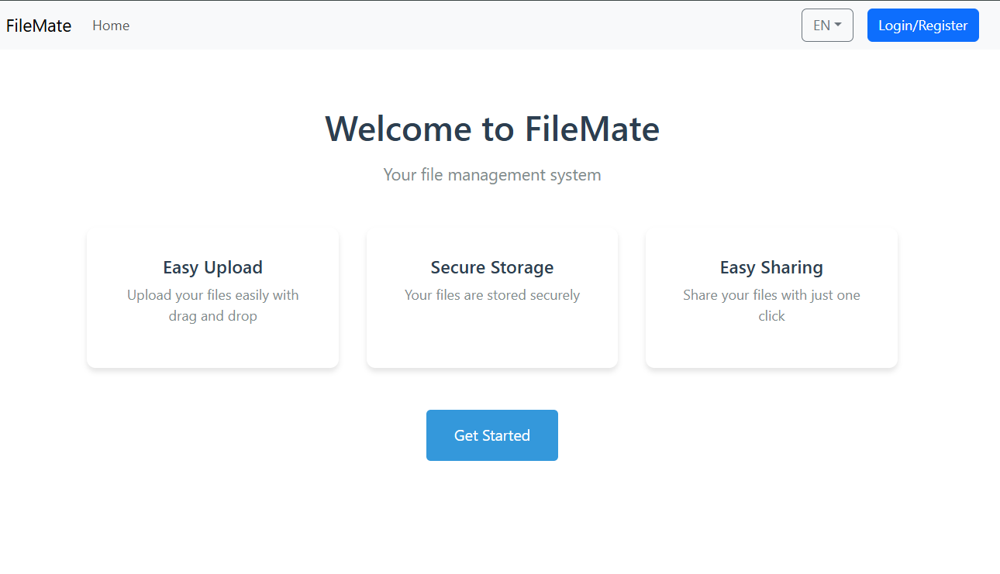

# FileMate - File Management System

## Table of Contents

- [📖 Introduction](#introduction)
- [🔧 Technologies Used](#technologies-used)
  - [🖥️ Frontend](#frontend)
  - [🧠 Backend](#backend)
- [⬇️ Installation Instructions](#installation-instructions)
  - [📚 Frontend (React.js)](#frontend-install)
  - [🧪 Backend (Node.js)](#node.js)
  - [📁 Complete Folder Structure](#complete-folder-structure)
- [🚀 After Installation](#after-installation)
- [🖼️ Example Screenshots](#example-screenshots)
- [🎥 Project Demo](#project-demo)

### Introduction

---

**FileMate** is a file management platform where users can perform file operations (upload, delete, download, update) and control the system via the admin panel.

Users:

- Can upload files
- Can update profile information
- Can change password

Administrators:

- Can view/delete all users and files
- Has authority over user roles

### Technologies Used

---

#### Frontend

- React.js
- Typescript (type safety)
- Bootstrap

#### Backend

- Node.js
- Express.js
- Sequelize ORM
- JWT (authentication)
- bcrypt (encryption)
- SQLite
- Jest (unit test)
- Swagger (API documentation)

### Installation Instructions

---

#### Frontend

**0. Install Node.js**

```url
https://nodejs.org/en/download
```

**1. Clone the repository:**

```git
git clone https://github.com/cemlevent54/FileMate
```

**2. Navigate to the project directory:**

```
cd FileMate
```

**3. Go to the frontend directory:**

```
cd filematewebapp
```

**4. Install dependencies:**

```
npm install
```

**5. Run the development server:**

```
npm start
```

**6. Visit the app:**

```url
http://localhost:3000
```

#### Backend

**0. Go to the backend directory:**

```
cd api
```

**1. Install dependencies:**

```
npm install
```

**2. Run migrations and you have a database.sqlite in database folder:**

```
npx sequelize-cli db:migrate
```

**3. Run Seeders:**

```
npx sequelize-cli db:seed:all
```

**4.Run command:**

```
node index.js
```

**5. Visit API Documentation (Swagger UI):**

```url
http://localhost:8030/api-docs
```

**6.Run tests:**

```
npm test
```

### Complete Folder Structure

---

You can review the project folder structure below to understand the layout:

```
Filemate
|
├── api
│   ├── config
│   ├── controllers
│   ├── database
│   │       ├── migrations
│   │       ├── database.sqlite
│   ├── helpers
│   ├── repositories
│   ├── routes
│   ├── seeders
│   ├── services
│   ├── storage
│   ├── tests
│   ├── app.js
│   ├── index.js
│   ├── package.json
│   ├── package-lock.json
│
├── docs
|
|
├── filematewebapp
│   ├── public
│   ├── src
│   ├── .env
│   ├── .gitignore
│   ├── Dockerfile.dev
│   ├── package-lock.json
│   ├── package.json
│   ├── tsconfig.json
|
├── .gitignore
└── README.md
```

### After Installation

---

**0.Register as a new user or log in with the admin account created with seeder.**

- Admin email: `admin@gmail.com`
- Admin password: `admin`

**1.After logging in:**

- You can upload, download, delete and update your files.
- You can edit your profile information and change your password.
- If you are logged in with an administrator account, you have full authority over all users and files.

### Example Screenshots

---













### Project Demo

---

_Demo video will be available soon. Stay tuned!_

Click the image to watch demo video!

[](https://www.youtube.com/)

### Contributors

---

This project was developed by Cem Levent Avcı. Feel free to reach out to me for questions, collaboration opportunities, or feedback.

### 📌 Cem Levent Avcı

- 📧 **Email:** [cemlevent54@gmail.com](mailto:cemlevent54@gmail.com)
